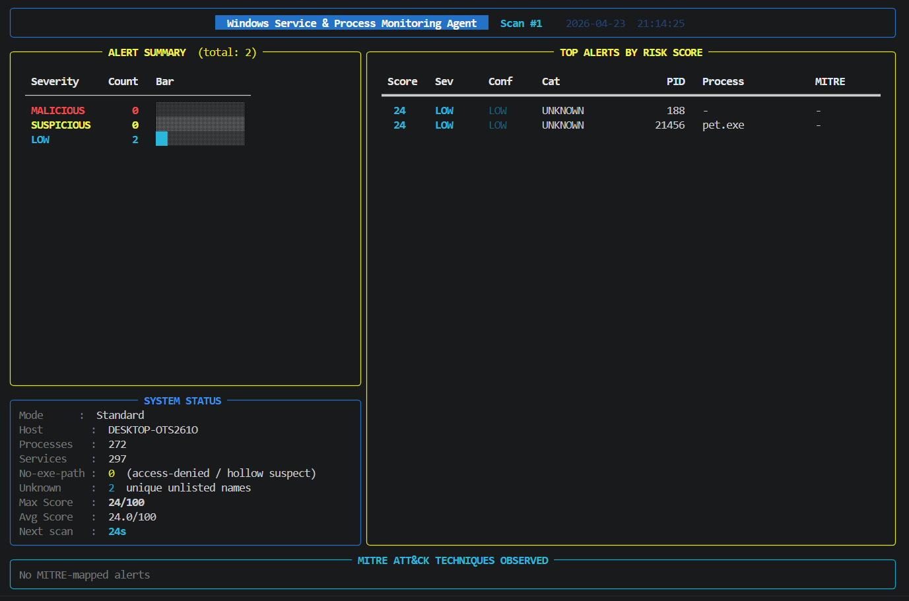
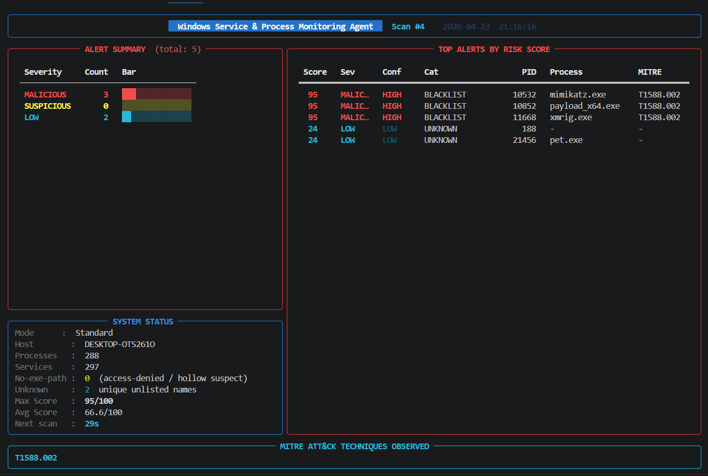
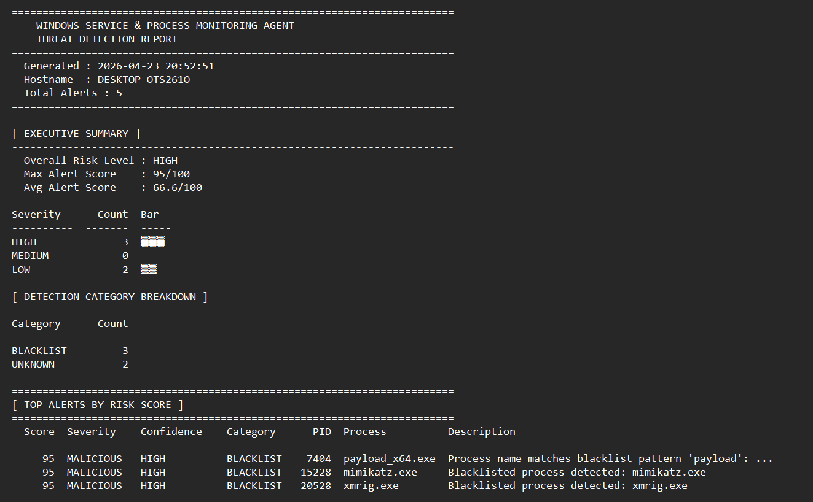

# Windows Service & Process Monitoring Agent


A modular, professional-grade Windows process and service monitoring agent built for **blue team operations**, **incident response**, and **defensive security research**.

The agent continuously analyzes running processes, service configurations, parent-child relationships, and system state changes to detect malicious, unauthorized, or suspicious activity — all mapped to the **MITRE ATT&CK framework**.

---

## 🎥 Demo

![Dashboard]

![Malicious-Detection]

![Output]


---

## ⚡ Key Highlights

- Real-time process & service monitoring
- MITRE ATT&CK mapped detections
- Baseline drift detection
- Automated threat response (process kill)
- SIEM-ready JSON logging

---

## Table of Contents

- [Overview](#overview)
- [Features](#features)
- [Architecture](#architecture)
- [Project Structure](#project-structure)
- [Prerequisites](#prerequisites)
- [Installation](#installation)
- [Usage](#usage)
- [Detection Techniques](#detection-techniques)
- [MITRE ATT&CK Coverage](#mitre-attck-coverage)
- [Output & Reports](#output--reports)
- [Configuration](#configuration)
- [Examples](#examples)
- [Disclaimer](#disclaimer)
- [Author](#author)
- [License](#license)

---

## Overview

Windows systems are a frequent target for malware, persistence mechanisms, and privilege escalation attacks. Attackers abuse:

- Malicious services registered under system privileges
- Abnormal parent-child process relationships (e.g., `winword.exe` spawning `powershell.exe`)
- Startup service manipulation for persistence
- Process name typosquatting to evade detection

This agent provides a **real-time, rule-based detection framework** that monitors these attack surfaces and generates structured alerts with severity scores, MITRE technique IDs, and full audit reports.

---

## Features

### Core Detection

| Feature | Description |
|---|---|
| **Parent-Child Analysis** | Detects 40+ suspicious process spawn chains (e.g., Office apps spawning shells) |
| **Service Auditing** | Flags unquoted paths, non-standard accounts, unsigned binaries, new services |
| **Unauthorized Process Detection** | Whitelist/blacklist enforcement with keyword pattern matching |
| **Typosquat Detection** | Levenshtein edit-distance check against critical system process names |
| **Suspicious Path Detection** | Flags executables running from Temp, AppData, Downloads, and Public directories |
| **Hash Checking** | SHA-256 and MD5 comparison against a known-bad hash database |
| **Signature Verification** | Authenticode verification via PowerShell `Get-AuthenticodeSignature` |

### Advanced Features

| Feature | Description |
|---|---|
| **Real-Time Watch Loop** | Continuous scanning with configurable interval (`--watch N`) |
| **Baseline Drift Detection** | Snapshot system state; future scans alert only on new/changed entries |
| **Auto-Response (Kill)** | Automatically terminate confirmed HIGH-severity malicious processes |
| **Rich Live Dashboard** | Full-screen terminal dashboard with live alert tables and MITRE footer |
| **Severity Scoring** | Numeric risk score (0–100) on every alert based on category and severity |
| **MITRE ATT&CK Mapping** | Every alert tagged with technique ID, name, and tactic |
| **Annotated Process Tree** | ASCII process tree with `<< [!ALERT!]` markers on suspicious nodes |

### Reporting

| Output | Format | Description |
|---|---|---|
| Console | Colored terminal | Live step-by-step output with MITRE tags |
| Log | JSON Lines (`.jsonl`) | Structured, timestamped, machine-readable event log |
| Text Report | `.txt` | Human-readable tabulated report with MITRE coverage section |
| JSON Report | `.json` | Full structured report with executive summary and alert breakdown |

---

## Architecture

```
START
  |
  v
Enumerate Processes & Services (psutil / WMI)
  |
  v
Build Parent-Child Process Tree
  |
  v
Detect Parent-Child Anomalies  -----> Alert Engine (scored + MITRE-tagged)
  |
  v
Audit Startup Services         -----> Alert Engine
  |
  v
Detect Unauthorized Processes  -----> Alert Engine
  |
  v
[Optional] Baseline Comparison -----> Alert Engine (drift alerts)
  |
  v
[Optional] Auto-Kill Response
  |
  v
Write JSONL Log
  |
  v
Generate TXT + JSON Report
  |
  v
END
```

---

## Project Structure

```
windows-service-process-monitoring-agent/
|
|-- main.py                        # CLI entry point (v3.0)
|-- requirements.txt               # Python dependencies
|
|-- config/
|   |-- whitelist.json             # Known-good process names (~90 entries)
|   |-- blacklist.json             # Known-bad process names + keyword patterns
|   |-- rules.json                 # Parent-child rules + MITRE mappings
|   |-- known_bad_hashes.json      # SHA-256 / MD5 known-bad hash database
|
|-- modules/
|   |-- alert_engine.py            # Alert dataclass, severity scoring, fingerprinting
|   |-- process_monitor.py         # Process enumeration + parent-child tree
|   |-- service_auditor.py         # Service enumeration + anomaly detection
|   |-- process_detector.py        # Blacklist / whitelist / hash / path detection
|   |-- response_engine.py         # Auto-kill: terminate confirmed threats
|   |-- baseline_manager.py        # Snapshot + drift detection
|
|-- reporting/
|   |-- logger.py                  # JSON Lines structured log writer
|   |-- report_generator.py        # TXT and JSON report generation
|
|-- utils/
|   |-- helpers.py                 # Hash computation, path normalization, signatures
|
|-- baseline/
|   |-- baseline.json              # Created at runtime by --baseline
|
|-- logs/
|   |-- monitor_YYYYMMDD_HHMMSS.jsonl   # Created at runtime
|
|-- reports/
    |-- report_YYYYMMDD_HHMMSS.txt      # Created at runtime
    |-- report_YYYYMMDD_HHMMSS.json     # Created at runtime
```

---

## Prerequisites

- **OS:** Windows 10 / 11 (Windows Server 2016+)
- **Python:** 3.10 or higher
- **Privileges:** Run as **Administrator** for full process and service visibility

> Without Administrator privileges, some processes (especially kernel and antivirus processes) will be skipped due to `AccessDenied` errors. Core detection still works for user-space processes.

---

## Installation

**1. Clone or download the project:**

```bash
git clone https://github.com/niteshghimire0147/windows-edr-agent.git
cd windows-edr-agent
```

**2. Install dependencies:**

```bash
pip install -r requirements.txt
```

**Dependencies installed:**

| Package | Purpose |
|---|---|
| `psutil` | Process enumeration, parent-child relationships |
| `wmi` | Windows Management Interface for service data |
| `rich` | Live dashboard, colored tables, panels |
| `colorama` | Colored plain-text console output |
| `tabulate` | Formatted text report tables |

---

## Usage

### Basic Scan

```bash
python main.py
```

Performs a single full scan and generates a report.

### All Options

```
python main.py [OPTIONS]

Core Options:
  --no-color              Disable colored terminal output
  --tree                  Print annotated parent-child process tree
  --signatures            Verify Authenticode digital signatures (slow)
  --config-dir DIR        Directory containing JSON config files (default: config/)
  --log-dir DIR           Output directory for JSONL logs (default: logs/)
  --report-dir DIR        Output directory for reports (default: reports/)

Real-Time Monitoring:
  --watch SECONDS         Scan continuously every N seconds
  --dashboard             Show rich live terminal dashboard (use with --watch)

Auto-Response (Kill):
  --kill                  Automatically terminate HIGH-severity threats
  --kill-dry-run          Show what WOULD be killed without acting
  --kill-force            Skip y/N confirmation prompt

Baseline Detection:
  --baseline              Save current system state as baseline, then exit
  --compare               Compare current scan against saved baseline
  --baseline-path PATH    Custom path for baseline.json
```

---

## Detection Techniques

### 1. Parent-Child Relationship Analysis

Monitors process spawn chains against 40+ rules. Flags when trusted applications are abused to launch shells or interpreters — a key indicator of macro malware, phishing payloads, and living-off-the-land attacks.

**Examples of detected chains:**

| Parent | Child | Threat |
|---|---|---|
| `winword.exe` | `powershell.exe` | Macro malware execution |
| `excel.exe` | `cmd.exe` | Malicious spreadsheet |
| `outlook.exe` | `wscript.exe` | Email-delivered payload |
| `mshta.exe` | `powershell.exe` | LOLBin abuse |
| `svchost.exe` | `cmd.exe` | Service hijack |
| `explorer.exe` | `svchost.exe` | Process injection indicator |

### 2. Service Auditing

Checks every registered Windows service for:

- **Unquoted service paths** — classic privilege escalation via path interception (`T1574.009`)
- **Suspicious binary locations** — Temp, AppData, Downloads directories
- **Non-standard service accounts** — auto-start services not running as LocalSystem / NetworkService
- **Unsigned service binaries** — Authenticode verification failure
- **Dormant auto-start services** — registered for persistence but currently stopped

### 3. Unauthorized Process Detection

Checks every running process against:

1. **Known-bad hash** (SHA-256 / MD5) → `CRITICAL` kill candidate
2. **Blacklist name** (exact match) → `HIGH`
3. **Blacklist keyword pattern** (e.g., "mimikatz", "payload") → `HIGH`
4. **Typosquatting** of critical system processes → `HIGH`
5. **Suspicious execution path** (Temp, AppData, etc.) → `HIGH`
6. **No resolvable executable** (possible process hollowing) → `MEDIUM`
7. **Not on whitelist** → `MEDIUM`

### 4. Baseline Drift Detection

Creates a cryptographic snapshot of all running processes and services. Subsequent scans compare against the snapshot and alert on:

| Change | Severity |
|---|---|
| New process appeared | MEDIUM |
| New auto-start service registered | HIGH |
| New non-auto-start service | MEDIUM |
| Service binary path changed | HIGH |
| Service account or start mode changed | MEDIUM |

### 5. Severity Scoring

Every alert carries a numeric risk score (0–100):

| Severity | Base Score | Category Modifier | Max Score |
|---|---|---|---|
| HIGH | 75 | +0 to +25 | 100 |
| MEDIUM | 45 | +0 to +25 | 70 |
| LOW | 15 | +0 to +5 | 20 |

---

## MITRE ATT&CK Coverage

| Technique ID | Technique Name | Tactic | Category |
|---|---|---|---|
| T1059.001 | PowerShell | Execution | Parent-Child |
| T1059.003 | Windows Command Shell | Execution | Parent-Child |
| T1059.005 | Visual Basic | Execution | Parent-Child |
| T1218.005 | Mshta | Defense Evasion | Parent-Child |
| T1218.010 | Regsvr32 | Defense Evasion | Parent-Child |
| T1543.003 | Windows Service | Persistence / Priv. Esc. | Service |
| T1574.009 | Path Interception (Unquoted) | Privilege Escalation | Service |
| T1036 | Masquerading | Defense Evasion | Blacklist |
| T1036.004 | Masquerade Task or Service | Defense Evasion | Typosquat |
| T1036.005 | Match Legitimate Name/Location | Defense Evasion | Suspicious Path |
| T1055 | Process Injection | Defense Evasion / Priv. Esc. | Unauthorized |
| T1204 | User Execution | Execution | Hash Match |

> Full MITRE technique URLs are embedded in JSON reports for direct reference.

---

## Output & Reports

### Console Output (single scan)

```
  Windows Service & Process Monitoring Agent  |  v3.0  |  Blue Team

  STEP 1 - Enumerating Processes & Services
  Captured 271 processes, 298 services.

  STEP 2 - Parent-Child Anomalies
  Found: 1
  [!] [HIGH] [Score:85/100] PARENT_CHILD | Suspicious parent-child: winword.exe -> powershell.exe
       PID: 4821  Process: powershell.exe
       MITRE: T1059.001 - PowerShell

  STEP 3 - Service Audit
  ...

  SCAN COMPLETE - SUMMARY
  Risk Level   : HIGH
  Total Alerts : 14
  HIGH   : 3
  MEDIUM : 9
  LOW    : 2
  Max Score    : 85/100

  MITRE ATT&CK Techniques Observed:
    T1059.001    PowerShell
    T1543.003    Windows Service
```

### JSON Report Structure

```json
{
  "report_metadata": {
    "generated_at": "2026-04-13T14:30:00",
    "hostname": "DESKTOP-EXAMPLE",
    "agent": "Windows Service & Process Monitoring Agent",
    "version": "3.0"
  },
  "executive_summary": {
    "overall_risk_level": "HIGH",
    "total_alerts": 14,
    "severity_breakdown": { "HIGH": 3, "MEDIUM": 9, "LOW": 2 },
    "score_statistics": { "max": 85, "average": 47.2 }
  },
  "mitre_attack_coverage": {
    "total_techniques_observed": 3,
    "techniques": [
      {
        "technique_id": "T1059.001",
        "technique_name": "PowerShell",
        "tactic": "Execution",
        "alert_count": 1,
        "url": "https://attack.mitre.org/techniques/T1059/001"
      }
    ]
  },
  "alerts_by_severity": { "HIGH": [...], "MEDIUM": [...], "LOW": [...] },
  "all_alerts": [...]
}
```

---

## Configuration

### Adding to the Blacklist (`config/blacklist.json`)

```json
{
  "processes": ["mimikatz.exe", "your_malware.exe"],
  "name_patterns": ["hack", "payload", "exploit"]
}
```

### Adding Known-Bad Hashes (`config/known_bad_hashes.json`)

```json
{
  "sha256": ["<sha256_hash_of_malicious_file>"],
  "md5":    ["<md5_hash_of_malicious_file>"]
}
```

Compute a hash with:

```bash
python -c "from utils.helpers import compute_file_hash; print(compute_file_hash('suspicious.exe'))"
```

### Adding Parent-Child Rules (`config/rules.json`)

```json
{
  "suspicious_parent_child": [
    {
      "parent": "your_app.exe",
      "child":  "cmd.exe",
      "description": "Custom app spawning shell",
      "mitre_id":    "T1059.003",
      "mitre_name":  "Windows Command Shell"
    }
  ]
}
```

---

## Examples

### Save a baseline, then monitor for drift

```bash
# Run once to save the current system state
python main.py --baseline

# On future runs, alert only on NEW or CHANGED entries
python main.py --compare

# Real-time watch with baseline comparison
python main.py --watch 60 --compare
```

### Live dashboard with auto-kill

```bash
# Full live dashboard, kill threats automatically every 30 seconds
python main.py --watch 30 --dashboard --kill --kill-force
```

### Dry-run kill (for demo / report purposes)

```bash
python main.py --kill-dry-run
```

### Full audit with signature verification and process tree

```bash
python main.py --signatures --tree --no-color > audit_output.txt
```

---

## Disclaimer

> **This tool is developed strictly for educational and defensive security purposes only.**
>
> - Use this tool **only on systems you own or have explicit written authorization to test**.
> - The auto-kill (`--kill`) feature **terminates running processes** — use with caution in production environments.
> - The authors and contributors accept **no liability** for misuse, damage, or unintended consequences resulting from the use of this tool.
> - Running this tool against systems without proper authorization may violate local, national, or international laws including the **Computer Fraud and Abuse Act (CFAA)** and equivalent legislation.
>
> **Always obtain proper authorization before running security tools on any system.**

---

## Author

**Nitesh Ghimire**
*Cybersecurity Enthusiast | Aspiring Purple Team Engineer*

| | |
|---|---|
| **Focus Areas** | Blue Team Operations, Threat Detection, DFIR, Malware Analysis |
| **Frameworks** | MITRE ATT&CK, Cyber Kill Chain, NIST |
| **Tools & Skills** | Python, PowerShell, Wireshark, Splunk, Windows Internals |

---

*Built as part of a hands-on defensive security project to demonstrate real-world Windows threat detection techniques.*

---

## 📜 License

This project is licensed under the [MIT License](LICENSE).
